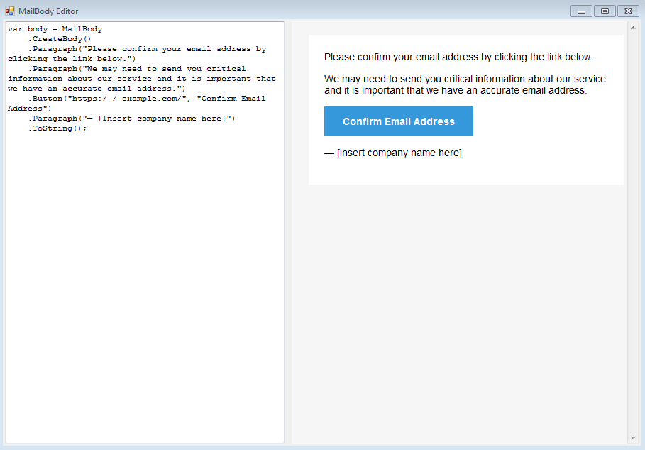

# MailBody Editor

Why email creation have to be difficult and annoying?
Create email with the [MailBody](https://github.com/doxakis/MailBody) library while having a live preview

    

- On the left side, write c#
- On the right side, see a live preview of your email

# Copyright and license
Code released under the MIT license.
